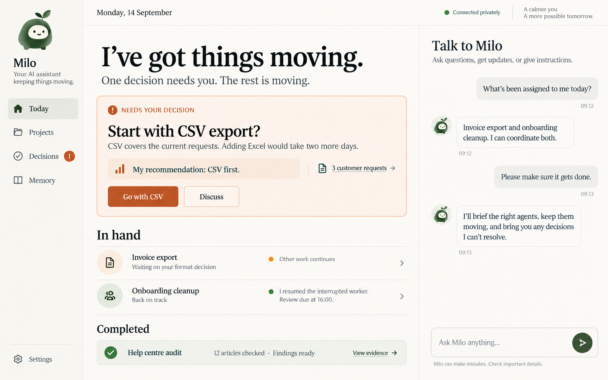
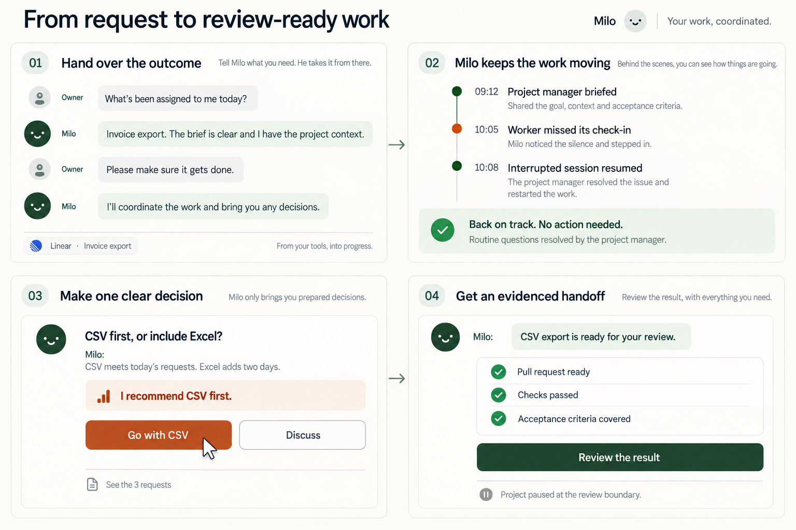

# Personal assistant: dashboard concept art

Date: 2026-09-14. Status: visual exploration, not implemented UI.
Nothing to pin: concept-only assets. Generated with the built-in image generation
tool; final prompts are preserved below.

## Direction

A calm daily home screen: prepared decisions first, concise project progress,
completion evidence, and an adjacent conversation. “Milo” and its avatar are
placeholders for the owner's configurable assistant identity.



## Interaction

The owner hands over an outcome. The PA coordinates an appropriate team,
investigates a missed check-in, presents a decision with a recommendation, and
returns a review-ready result with evidence. The activity sequence is available
for inspection; each entry would not trigger an owner notification. A manager
is appropriate for this example, not mandatory for every task.



These are independent concept illustrations, with small differences in typography
and avatar treatment. A production design would unify them. The review handoff
illustrates this particular work order's completion boundary; it does not imply
every outcome must require owner review. No deployment is depicted.

## Final generation prompts

### Dashboard

```text
Use case: ui-mockup
Asset type: high-fidelity desktop dashboard concept art for a personal AI assistant, landscape 16:10, sharp readable UI.
Primary request: Design a beautiful, credible daily home screen for a Go daemon's web dashboard. This personal assistant coordinates other agents and absorbs project management; the owner primarily sees prepared decisions and evidence of progress. Use the example assistant name "Milo", a configurable placeholder, with a small friendly abstract character avatar.
Style: restrained editorial productivity application, warm ivory background, ink typography, muted forest green status, restrained burnt-orange decision accent, fine dividers, generous whitespace, excellent typography. Flat straight-on full screen UI, not a photograph of a monitor. Bespoke and polished, legible, not futuristic, no gradients or glowing effects. Modest rounded corners, avoid a dashboard full of interchangeable metric tiles.
Composition: narrow left navigation; spacious central main area about 65%; right conversation panel about 28%. Strong information hierarchy, large calm headline, decisions before activity. Top header with date "Monday, 14 September" and subtle "Connected privately" connection indicator. Sidebar name/avatar "Milo", selected "Today", then "Projects", "Decisions" with badge 1, "Memory", settings at bottom.
Central main exact copy and structure:
Headline "I've got things moving."
Subheading "One decision needs you. The rest is moving."
Prominent beautifully composed decision card with small label "NEEDS YOUR DECISION", title "Start with CSV export?", text "CSV covers the current requests. Adding Excel would take two more days.", recommendation callout "My recommendation: CSV first.", two concise actions "Go with CSV" and "Discuss", subtle evidence link "3 customer requests".
Below, a clean editorial list titled "In hand" with two project rows:
"Invoice export" — "Waiting on your format decision" — tiny status amber and "Other work continues".
"Onboarding cleanup" — "Back on track" — "I resumed the interrupted worker. Review due at 16:00." — green status.
Below, one simple outcome strip "Completed" / "Help centre audit" / "12 articles checked · Findings ready" with "View evidence".
Right panel heading "Talk to Milo"; compact ongoing conversation bubbles:
Owner: "What's been assigned to me today?"
Milo: "Invoice export and onboarding cleanup. I can coordinate both."
Owner: "Please make sure it gets done."
Milo: "I'll brief the right agents, keep them moving, and bring you any decisions I can't resolve."
Bottom composer "Ask Milo anything…" with a send arrow.
Constraints: Synthetic example data only. No actual company logos. No code, terminal panels, token charts, deployment buttons, purchasing controls, elaborate agent trees, kanban or giant KPI counters. PA coordinates; workers perform project work. Project completion is review-ready work, never production deployment. All important text large and accurate. Fit entire design comfortably inside frame. This is a concept, no browser chrome needed.
```

### Storyboard

```text
Use case: ui-mockup
Asset type: four-panel product interaction storyboard, landscape 3:2 concept board, high resolution with very legible text.
Primary request: Show how an owner interacts with "Milo", a configurable personal AI assistant that coordinates project agents, notices silence, resolves ordinary questions, and escalates only prepared decisions. Four numbered panels in a precise 2 by 2 grid, clear reading order. Each panel is a generous close-up fragment of the same web app, not a full miniature dashboard. Thin arrow connectors and small stage headings. A small overall title "From request to review-ready work".
Visual style: restrained editorial product design, warm ivory background, ink text, forest-green status, burnt-orange decision accents, fine dividers, roomy layout. Flat clean front-on UI, beautiful sans-serif typography, tiny friendly abstract Milo avatar. No photoreal monitor or people. Match a calm personal assistant dashboard aesthetic. Maximize readable text and show functional controls.
Panel 1 stage heading "01  Hand over the outcome"
Simple chat exact text:
Owner: "What's been assigned to me today?"
Milo: "Invoice export. The brief is clear and I have the project context."
Owner: "Please make sure it gets done."
Milo: "I'll coordinate the work and bring you any decisions."
Footer small source chip "Linear · Invoice export".
Panel 2 stage heading "02  Milo keeps the work moving"
A tidy vertical activity sequence with three steps and timestamps, not a busy tree:
"09:12  Project manager briefed"
"10:05  Worker missed its check-in"
"10:08  Interrupted session resumed"
A green highlighted status line "Back on track. No action needed."
Small secondary note "Routine questions resolved by the project manager."
This panel shows behind-the-scenes work the owner may inspect, not three notifications sent to them.
Panel 3 stage heading "03  Make one clear decision"
A decision card titled "CSV first, or include Excel?"
Milo: "CSV meets today's requests. Excel adds two days."
Prominent recommendation "I recommend CSV first."
Buttons "Go with CSV" (selected or clicked cursor) and "Discuss".
Small muted evidence link "See the 3 requests".
Panel 4 stage heading "04  Get an evidenced handoff"
Milo: "CSV export is ready for your review."
Three short checkmarked evidence rows: "Pull request ready", "Checks passed", "Acceptance criteria covered".
Primary button "Review the result".
Secondary small status "Project paused at the review boundary."
Constraints: The PA delegates implementation; never depicts it coding or deploying. No 'deployed', no 'shipped', no purchases. Do not imply owner must review vague plans. Only one real decision is escalated in the story. Readable exact text, balanced generous space, avoid tiny text. This is one single cohesive visual storyboard image.
```
