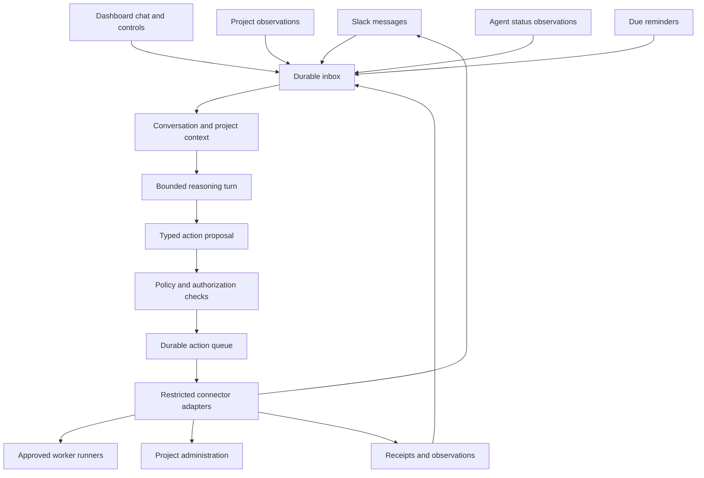

# A personal assistant that coordinates project agents

Proposal date: 2026-09-14. Status: exploratory design, not an implementation commitment.
Reference: `agent-code-review` at `b2368459c51964c425fee624cc88fb9cb10c967e`.
External documentation checked on 2026-09-14; no provider SDK versions selected.
All commands, package names, policies, and examples below are proposed.
Owner clarifications incorporated: AI inference and worker invocation are expected
operating costs; “never spend money” means no purchasing. The assistant itself
would run an AI agent, and a dashboard belongs in the initial product. Its main
job would be to absorb coordination work and bring the owner clear decisions.

## The product I would build

A personal assistant whose job is to keep the owner's projects moving: remember
commitments, find missing decisions, understand which agents are doing what, and
bring the right question to the owner at the right time. Success would mean fewer
things to remember and fewer agent sessions to check manually.

The assistant would own coordination records, conversations, reminders, and
delegation briefs. Project agents would own implementation and project deliverables.
The assistant would never take over a blocked worker's task.

Example of the useful interaction:

> The migration needs one scope decision: include legacy imports in this release?
> I recommend deferring them. The implementation and review agents agree that
> including them adds a separate compatibility path; neither found a current
> customer commitment requiring it. Deferring preserves the agreed release scope.
> If you agree, I'll update the brief and unblock the agent. If legacy support
> is required now, I'll have the agents return a revised delivery estimate.

The model's value would be deciding which facts matter and explaining them. The
daemon's value would be remembering reliably, enforcing boundaries, and making
sure an instruction reaches the intended agent once.

I would create a sibling `agent-assistant` repository with its own state and
release lifecycle. The executable name would stay stable; the assistant's chosen
name would be configuration. I would borrow patterns from the reviewer before
extracting a shared daemon framework: there is not yet enough evidence about
which abstractions both products need.

## The owner should receive decisions, not coordination homework

The assistant would be responsible for carrying context, chasing responses,
turning vague plans into accountable work orders, and establishing what is
actually blocked. The owner should not need to open agent logs or reconstruct
the project to answer a question.

Every active project would have a maintained coordination brief: goal, current
scope, success criteria, decisions and their reasons, constraints, dependencies,
active work orders, and unresolved questions. Source references and revision
numbers would make updates traceable. A new agent would receive this context
automatically. A changed decision would be sent to affected agents with an
acknowledgement tracked; the assistant would not assume every worker had read it.

Before starting a worker, the assistant would check that the work order names
an outcome, scope, dependencies, evidence expected at completion, and conditions
that require escalation. If an agent returned a vague plan, the assistant would
ask that agent to make it concrete. The owner would not be asked to approve a
page of intentions. Evaluating whether a plan answers the brief is coordination;
designing the implementation or performing the investigation is project work
and would be delegated.

For a blocker, the assistant would first retrieve existing decisions, ask the
responsible agent for the missing evidence, and coordinate with the dependency
owner where authorized. Routine choices covered by standing preferences or
project scope would be resolved without interrupting the owner. Evidence gaps
would normally go to a worker to investigate, rather than becoming questions
the owner must research. Follow-ups would have bounded retries and deadlines so
agent-to-agent discussion could not continue indefinitely.

Escalation would be reserved for a real owner choice: conflicting priorities,
changed scope, commitments to other people, an unavailable authorization, or a
tradeoff the existing preferences cannot resolve. Each decision would include:

- The precise choice and why it needs the owner now.
- A recommended option, viable alternatives, and consequences.
- Supporting evidence, uncertainty, and what agents already checked.
- What waits on the answer, any deadline, and what happens if no answer arrives.
- The concrete coordination actions that will follow the answer.

Decision cards would be versioned, deduplicated, and retired when circumstances
changed. Replies in Slack or the dashboard would resolve the same decision and
update the shared brief once. Missing answers would follow an explicitly agreed
default where one existed; silence would never create new permission.

During onboarding, the owner would establish practical standing instructions,
such as “coordinate implementation and review on these projects within the agreed
scope; bring scope changes and unresolved priority conflicts to me.” Those
instructions would persist. The assistant should not repeatedly ask permission
to chase, clarify a brief, pass a decision along, or assign already-authorized
work.

The pilot should measure how often the owner had to repeat context, chase an
agent personally, clarify an assistant question, or investigate a supposed
blocker. It should also check whether accepted decisions actually unblocked work.
Messages sent and agents launched would not be success metrics. A dashboard
that merely made unfinished coordination visible would fail this product goal.

## Define the boundary before selecting an engine

The following interpretation would reconcile “help set up projects” with “never
do project work.” It needs agreement before implementation, but gives a concrete
starting point.

| Activity | Proposed boundary |
| --- | --- |
| Talk to the owner | Answer questions, send useful updates, ask for decisions |
| Understand projects | Read allowed project metadata, task descriptions, status, and linked agent summaries |
| Set up a project | Capture the owner's goal, scope, owner, milestones, and acceptance criteria; create coordination records when instructed |
| Coordinate agents | Prepare work briefs, delegate within an authorized scope, relay decisions, track progress |
| Produce project deliverables | Forbidden for the assistant, including implementation code, patches, technical investigations, and substantive project documents |
| Deploy or operate production | Forbidden, including production reads, writes, migrations, and indirect requests to do them |
| Purchase things | Forbidden: buying goods/services, provisioning paid infrastructure, changing plans, subscribing, or purchasing credits |
| Use configured AI services | Expected: the assistant's own inference and delegated agent runs, across configured payment models |

A coordination brief could say “determine why the import fails, return evidence
and a proposed fix.” It would not contain the fix or investigate the repository
itself. Creating a repository, writing its README, or scaffolding code would go
to an explicitly authorized project worker. Creating a Linear project would be
an administrative action with an inspectable set of fields.

These limits must also apply to delegation. “Ask another agent to deploy” is
still causing a deployment. Workers may write code because implementation is the
reason for delegating to them; deployment, production access, and purchasing
would remain outside assistant-issued work orders.

Model inference and worker execution would be operating costs explicitly within
the product's purpose. The owner would configure providers and runner profiles;
the assistant could use them without asking permission for every inference call.
Profiles could use subscriptions, metered APIs, or local models. The assistant
would never sign up for a provider, buy credits, upgrade a plan, or enable
automatic top-ups to get around an exhausted allowance.

Usage controls would distinguish subscription headroom, reported API cost, and
estimated cost. An estimate is not an invoice and subscription usage is not
incremental cash expenditure. Configurable turn limits, concurrency, retry bounds,
and daily operating budgets would prevent runaway activity. Provider-enforced
limits would be needed wherever a strict monetary ceiling is required; delayed
usage reports cannot establish one. Unknown pricing would be visible and handled
by the owner's configured budget policy, not silently treated as free.

Future phone calls or avatar generation could use an already configured service
when the owner enabled that capability. Purchasing the service or changing its
commercial terms would remain unavailable.

## Reuse the daemon's mechanics; narrow the engine's authority

The repository already provided useful patterns:

| Reference | What I would carry over |
| --- | --- |
| `internal/cli/serve.go`, `shutdown.go` | Preflight, bind before starting work, graceful stop followed by force stop |
| `internal/scheduler/lifecycle.go`, `dispatch.go` | Independent observation and dispatch, bounded concurrency, cancellation before new work |
| `internal/scheduler/reconcile.go` | Durable recovery records and reconciliation after a crash |
| `internal/scheduler/scheduler.go` | Dependencies declared at construction, injectable clock and narrow collaborator interfaces |
| `internal/review/driver.go` | Structured engine responses, bounded turns/resumes, durable transcripts |
| `internal/config`, `internal/doctor` | Configuration snapshots and actionable dependency diagnostics |

The review engine is trusted to use tools and perform external actions before
reporting what happened. For this product, the engine should propose actions and
the daemon should execute only permitted actions. The useful principle remains:
Go owns deterministic behavior; the model owns judgment. Here, authorization
and external side effects belong to the deterministic part.

I would not copy the PR-shaped queue, scoring machinery, permissive engine tool
environment or unauthenticated public dashboard.
Unavailable project data should degrade visibility; unavailable authority or
an exhausted configured operating budget should prevent the affected action.

## A small event-driven service

The daemon would wake for a message, a material project change, an agent status
change, or a due commitment. Polling and change detection would be deterministic.
Unchanged polls would not invoke a model. A short debounce would collect bursts
of related updates before a reasoning turn.

One decision stream per conversation would preserve ordering. Project-level
version checks would prevent two conversations from allocating the same task.
The owner could keep talking while remote workers ran; their execution would
never occupy the assistant's conversation slot.

### The assistant is an agent hosted by the daemon

The AI runtime would be a core component from the first conversational release.
It would interpret requests, retrieve relevant context through scoped tools,
ask clarifying questions, maintain commitments, prepare project briefs, choose
appropriate workers, and explain progress. This requires a multi-step agent loop,
not only a summarization call after a cron job.

Each activation would load the persona, relevant memory, conversation history,
and fresh observations. The model could request scoped reads, receive results,
propose authorized actions, and continue until it replied or reached a turn/tool
budget. Tool requests would go through the daemon's broker. Durable state would
live outside the model session so compaction, restart, or an engine switch could
not lose commitments or grants.

The assistant runtime and the project runner would be separate interfaces even
if both used the same underlying model provider. Their credentials, workspaces,
tools, prompts, usage accounting, and session IDs would be separate. The assistant
could reason about coordination extensively while still lacking the tools to do
implementation work.

I would start with one assistant engine adapter and one worker runner adapter.
The engine choice should follow a short spike proving streaming, controlled
tool access, resume behavior, and usage reporting. The reviewer's subprocess
drivers are useful references; its normal tool permissions are not a suitable
assistant default. Direct model APIs and isolated agent CLIs are both candidates,
with no assumption that a CLI's default environment is sufficiently restricted.

For a first implementation, I would use Go, Cobra, the family CLI/output
libraries, and a local SQLite database with one daemon owning mutations. This
workload is primarily small transactions over events, commitments, and delivery
receipts. SQLite documents application-local storage as a suitable use; this is
a workload recommendation, not a requirement to copy the reviewer's DuckDB
choice. The driver and CGO-free packaging would need verification in the initial
spike. See [SQLite's intended uses](https://www.sqlite.org/whentouse.html).

The CLI would communicate with the daemon over a local authenticated socket.
`run --once` would take exclusive ownership when the daemon was absent. One
process owner is sufficient initially; a distributed queue is unnecessary.

State would include these records, without introducing a separate service for
each:

- Inbox events with source IDs, versions, timestamps, and processing status.
- Project bindings, explicitly linking tracker IDs, allowed repositories, and
  worker session IDs.
- Agent observations with source, freshness, phase, blocker, and artifact links.
- Conversations, owner decisions, editable preferences, and commitments.
- Action proposals, authorization scope, attempts, provider receipts, and audit
  records.

Provider facts would remain provider-owned. The assistant would retain cached
observations and its own coordination history, not become another task tracker.
Every status claim should be traceable to a source and observation time.

## Make prohibited actions unavailable

The reasoning engine would receive a bounded context and a small typed action
catalog, such as:

- `reply_to_owner`, `ask_owner`, `remember_preference`, `schedule_followup`.
- `read_project`, `read_agent_status`, `get_linked_status_detail`.
- `propose_project`, `create_project_record`, `create_task_record`.
- `delegate_task`, `relay_owner_decision`, `request_agent_status`.

The daemon would resolve recipients, project IDs, runner profiles, and credential
references. Proposals would carry intent and expected versions; they would not
carry arbitrary shell commands, raw HTTP requests, SQL, or executable payloads.
Unknown operations and fields would be rejected.

There would be no shell, repository mount, browser automation, generic file
writer, production connector, payment connector, or unrestricted MCP discovery
in the reasoning environment. Existing family CLIs could be wrapped behind fixed
adapter operations, but would not be exposed wholesale to the model.

An isolated reasoning process would have a sanitized environment and no access
to the operator's home directory, connector tokens, inherited agent tools, or
project credentials. Its network would be limited to the selected inference
endpoint or local broker. An engine adapter would be eligible only after proving
these properties; disabling a few visible tools in a normal coding session
would not suffice. No particular hosted engine or desktop session API is assumed
available by this proposal.

The policy would have three distinct layers:

1. **Fixed product prohibitions:** no implementation by the assistant, deployments,
   production access, or purchasing. Conversation and personality could not
   override these.
2. **Owner-granted scope:** allowed projects, recipients, runners, administrative
   actions, and expiry. An explicit request could authorize the requested action
   without a second confirmation; ongoing delegation would use a bounded standing
   grant.
3. **Preferences:** tone, timing, verbosity, initiative, and presentation.

Normal read/summarize/reply behavior in the configured owner DM would proceed
automatically. Creating tracker records or assigning work would use an explicit
request or matching standing grant; the owner would not reconfirm actions already
inside that scope. The assistant would prepare the exact action before seeking
a genuinely missing grant. A generic “yes” could authorize
only the specific pending proposal in that conversation, tied to its version
and expiry. Grants would never enable a prohibited operation.

Slack sender identity would be checked using stable workspace and user IDs.
Project text, agent output, forwarded messages, and quoted owner text would be
evidence, not authorization. Persona and memory edits would not modify policy.
Administrative dashboard mutations would use the same authorization path, with
authentication and protection against cross-site requests even on localhost.

Capability restrictions can prevent tool effects, but cannot prove that generated
prose never contains implementation advice. The role prompt and behavioral
evaluations must cover that semantic boundary too. The product should not claim
that a JSON schema or an instruction classifier proves all behavior safe.

## Delegation is a durable work order

Before starting work, the assistant would record a work order containing:

- A stable ID, project/issue binding, owner instruction or grant, and objective.
- Scope, exclusions, acceptance criteria, and dependency references.
- Approved runner profile, allowed workspace, billing mode, and operating limits.
- Expected status reporting and an execution bound.

The runner adapter would own `start`, `status`, and `send_decision`. Each
capability would be declared independently: a runner that cannot safely start
work could still expose status. Stop/cancel support could follow after its
semantics were established. Workers would receive minimum necessary context,
never the assistant's whole memory or credentials.

The runner's execution environment must enforce its profile: project code work
may be enabled while deployment credentials, production access, and purchases
remain unavailable. A broadly privileged existing session cannot be made safe
by appending “don't deploy” to a prompt. Such a session should initially be
observable only, with work instructions handed back to the owner.

A heartbeat would mean the runner was reachable, not that useful progress had
occurred. Status should distinguish working, waiting for input, waiting for an
external dependency, reported complete, failed, and unknown/stale. Silence would
produce “last observed 40 minutes ago,” not an invented claim that the worker
had stalled. A completion report would link evidence for the owner or a review
agent; the assistant would not inspect code or run tests to verify it itself.

Retries are the hard part. Inbox records would be deduplicated before processing.
An action and its outbound intent would be committed together before calling a
provider. Each action would retain its idempotency key and external receipt.
After a timeout or crash, reconciliation would query the provider before trying
again. If the provider could neither deduplicate nor look up the result, the
action would become “delivery uncertain” and require resolution, not a blind
retry that might launch another worker or create another project.

Boot recovery would reconcile external sessions; a dead assistant process does
not imply its workers died. Policy and grants would be checked again immediately
before execution. Revocation would cancel pending actions; already running work
would receive a stop request only where the runner supported it, and remain
explicitly unresolved until acknowledged.

## Slack and the dashboard share one assistant

The dashboard would ship in the initial conversational release, not as a later
observability add-on. Slack and web chat would be two ways to reach the same
assistant. Durable conversations and decision IDs would preserve continuity
across surfaces, while simultaneous replies would be serialized or rejected as
stale rather than applied twice.

The home page would be **Needs you**: prepared decisions with recommendations,
consequences, and a clear next action. If nothing needed the owner, it would say
so and show what the assistant was handling. Raw plans and logs would sit behind
supporting links, not become a daily review queue.

| View | Purpose |
| --- | --- |
| Needs you | Resolve prepared decisions, see recommendations, snooze when appropriate |
| Conversation | Talk to the assistant with continuity from Slack |
| Projects | See outcomes, current commitments, dependencies, and recent decisions |
| Agents | See linked work orders, status freshness, blockers, and evidence links |
| Activity | Inspect what the assistant did, why, and under which instruction |
| Settings | Edit identity, memory, notification preferences, permissions, and provider/runner limits |

Usage would be visible for the assistant and workers separately, with totals
broken down by provider and payment model. Unknown costs would be labelled.
Pause controls would distinguish pausing new delegation, muting proactive
notifications, and requesting cancellation of supported running work. A pause
should not prevent the owner from opening the dashboard or asking for status.

My default frontend choice would be TypeScript, Svelte, and Vite, matching the
existing dashboard. The reason is practical reuse of its build setup and
interaction patterns; the core design does not depend on Svelte. A static SPA
embedded in the Go binary would keep installation to one application, with no
separate frontend server in production. Use an authenticated JSON API for actions
and server-sent events for chat/status updates, with event IDs and snapshot
recovery after reconnect. The daemon would remain the only authority on state.

The initial views would be Needs you, Conversation, and Settings, with Projects
and Agents growing alongside their connectors. Styling should emphasize readable
decision cards and visible reasons, with keyboard navigation and progressive
detail. I would reuse the reviewer's frontend tooling and embedded-build pattern,
not its PR-centric navigation or unauthenticated exposure model.

## Start integrations with owner Slack DMs

I would start with one private Slack app, one owner, and DMs. Slack's Socket Mode
can deliver events over WebSockets without a public HTTP endpoint, which fits a
local daemon. The connector must handle acknowledgements, reconnects, duplicate
events, and its own-message filtering. Persist received events before acknowledging
them, keeping reasoning off the acknowledgement path. Socket Mode apps currently
cannot be listed in Slack's public Marketplace, which matters only if distribution
becomes a goal. See [Slack Socket Mode](https://docs.slack.dev/apis/events-api/using-socket-mode/).

The adapter would start with the smallest scopes for the selected DM operations.
Messages to other people, channel posts, and reading broad workspace history
would be separate grants. Availability depends on the host remaining awake and
connected; the daemon should report reconnect gaps and reconcile available
history without claiming it recovered every missed event.

For Linear, initial project selection would be explicit links plus a configurable
ownership mapping: for example, project lead rather than every project containing
an assigned issue. Poll allowed metadata initially; add authenticated webhooks
when lower latency warrants an ingress endpoint.

Linear exposes agent sessions and activities, but its `AgentSessionEvent`
webhooks deliver events for the installed agent itself. They are not a universal
feed of all workers. Cross-agent visibility therefore needs explicit runner
adapters and project/session bindings, with permissions verified in a spike.
See [Linear agent interaction](https://linear.app/developers/agent-interaction).

Automatically matching an agent to a project from its title could propose a
binding, but should not authorize messages or dispatch. Workers started by the
assistant would be linked at creation; existing sessions would be linked by an
explicit registration or owner-confirmed match.

WhatsApp and phone would later implement the same conversation transport with
stable owner identity, receipt tracking, and channel-specific delivery rules.
Transport adapters would not own project state or policy. No automatic fallback
to another channel would be implied by a failed Slack send.

## Remember commitments and protect attention

The most useful persistent object may be a commitment: who owes what, in which
project, by when, and what should happen if it remains unresolved. A conversation
summary alone does not reliably encode that responsibility.

The assistant would remember explicit preferences and decisions with provenance,
allow the owner to inspect and forget them, and expire inferred facts. It would
never promote an inference into a permission. Sensitive message bodies would
have configurable retention; deleting them would also remove derived summaries
and indexes. Minimal action receipts could be retained separately under an
explicit retention policy, without retaining the deleted content.

Proactive behavior would focus on unanswered decisions, approaching commitments,
worker requests for input, and completed work requiring the owner's attention.
Use quiet hours in the owner's timezone, a configurable notification budget,
per-subject cooldowns, and a digest for low-priority changes. Suppress unchanged
conditions until their agreed follow-up time. The owner could snooze or dismiss
an obligation without making the underlying project disappear.

Start with hand-authored rules for due dates and status transitions. Let the
model rank and explain candidate updates; do not wake it continuously to ask
whether anything looks interesting.

## Personality should be editable, bounded configuration

The identity could include a display name, pronouns, tone, humor level, verbosity,
initiative, and avatar. Onboarding could offer “choose with me” or “surprise me.”
The latter would authorize selecting a name, profile, and built-in avatar without
another confirmation. Local identity would stay consistent across conversations;
publishing a provider profile would be a separate supported adapter operation.

The first avatar system could use a bundled set or a deterministic renderer
driven by a palette and seed. The model would choose parameters, not write SVG,
JavaScript, or image-generation code. Existing uploaded art could also be selected.
An enabled image service could generate alternatives within its configured
operating budget; the assistant could not purchase access to one.

Personality would influence presentation, never authority, memory provenance,
notification ceilings, or the permission to invent facts. The assistant could
propose later personality changes; it should not silently rewrite its identity
or use “initiative” as permission to start additional work.

## Build in slices with observable exit criteria

| Slice | What would ship | Exit criterion |
| --- | --- | --- |
| 0. Prove boundaries | Fake connectors, isolated reasoning adapter, typed policy, durable inbox/outbox | Prohibited actions cannot reach a connector; duplicate and crash cases cannot silently repeat actions |
| 1. Useful conversation | AI assistant runtime, owner Slack DM, authenticated dashboard with decision inbox and chat, editable identity, memory, commitments | Conversation continues across Slack/web and restart; commitments persist; inference usage is recorded |
| 2. Project visibility | Linear reads, explicit project bindings, one runner status adapter, project/agent dashboard views | Every status has a source and freshness; stale data is shown honestly; unchanged conditions stay quiet |
| 3. Active coordination | One runner's start/decision actions, standing grants, concrete work orders, blocker follow-up, reconciliation | Context reaches workers automatically; routine blockers are handled; owner questions arrive as prepared decisions; ambiguous delivery never triggers blind dispatch |
| 4. Project setup | Guided goal capture, exact previews, tracker project/task creation | Partial creation resumes from receipts and does not duplicate records |
| Later | Additional runners and transports, richer dashboard controls | Each adapter proves identity, policy, usage accounting, and recovery behavior before gaining write capabilities |

An initial package layout could be `cli`, `config`, `store`, `assistant`,
`policy`, `scheduler`, `channels/slack`, `projects/linear`, `runners`, `dashboard`,
and `doctor`. Inbox/outbox persistence would live in `store`; identity and memory
would start as assistant records. No plugin marketplace or general workflow
language would be necessary.

The CLI could expose `init`, `doctor`, `serve`, `run --once`, `status`,
`projects ls/link`, `agents ls/link`, `commitments ls`, `actions show`,
`permissions ls/revoke`, `identity show/set`, and `memory ls/forget`.
Local inspection should remain usable when Slack or inference is unavailable.

Tests worth writing first would simulate injected tracker instructions, spoofed
owner identity, stale decisions, changed scope, revoked grants, exhausted budgets,
duplicate Slack events, out-of-order status, restart after a successful external
write, and cancellation racing with dispatch. Behavioral examples would check
that the assistant delegates an implementation question rather than solving it,
reports uncertain progress honestly, and asks a necessary question once. Product
scenarios should require carrying context to a replacement worker, pushing back
on a vague plan, resolving a known blocker from an earlier decision, and bringing
an unresolved tradeoff with evidence and a recommendation. The test should fail
if the assistant merely forwards the worker's vague question to the owner.

## Decisions to settle before implementing

The proposed defaults were: local single-owner daemon hosting an AI assistant,
private Slack DMs and an authenticated dashboard, explicit project bindings,
coordination-only tracker writes, and one runner integration. Configured AI
operating costs would be permitted; purchasing would remain prohibited. The
first useful milestone would answer **“what decision needs me, what do you
recommend, and what will you handle after I answer?”**

Three choices remain material:

1. Which runner contains the agents the owner actually wants to coordinate, and
   can it expose status, restricted dispatch, and reconciliation outside a GUI?
2. Which assistant model/runtime should be configured first, and what operating
   limits should apply to its usage and delegated work?
3. Are briefs and tracker administration the intended project-setup boundary,
   and what default standing scope lets the assistant coordinate without making
   the owner repeatedly approve routine work?

These are implementation inputs. Read-oriented conversation and reliable
commitments would validate the foundation; active follow-up and delegation would
be required before claiming the product had removed the owner's coordination work.

## Research and requirements addendum, 2026-09-14

The subsequent [stack research](2026-09-14-personal-assistant-stack.md) is the
current recommendation for technology and supervision. The owner specified our
own Go codebase, with no OpenClaw clone or extension as its foundation. The
research recommends testing Eino and Restate's Go SDK, retaining the family CLI
patterns, and using a React/Vite dashboard. This supersedes the provisional
frontend choice and the earlier assumption that we would implement all durable
execution mechanics directly in the daemon.

The PA should decide how to organize delegated work. A manager is an optional
agent role chosen during execution, not a predefined product layer. Questions
should travel through the actual responsibility chain and reach the owner only
when the agents cannot resolve them within existing scope and decisions.

Accepting responsibility also means supervising progress. The PA should check
expected updates, investigate a silent team, distinguish completed work from a
blocker or interruption, and recover the work where authorized. Completion
requires the agreed evidence. The research document specifies the recovery
states and a failure-injection spike for this behavior.
