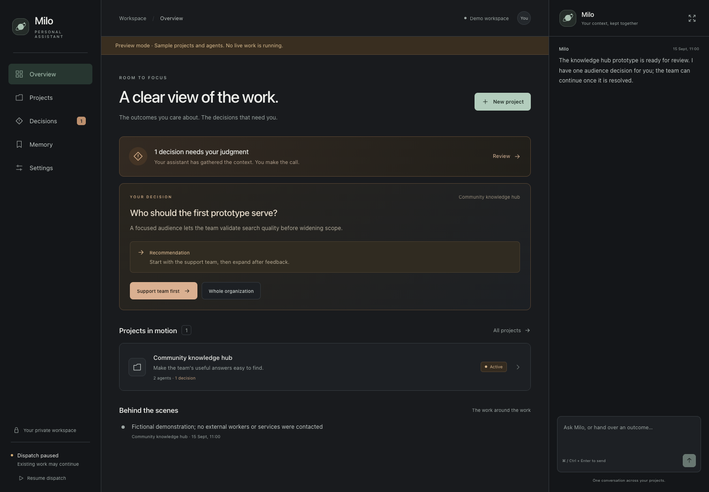
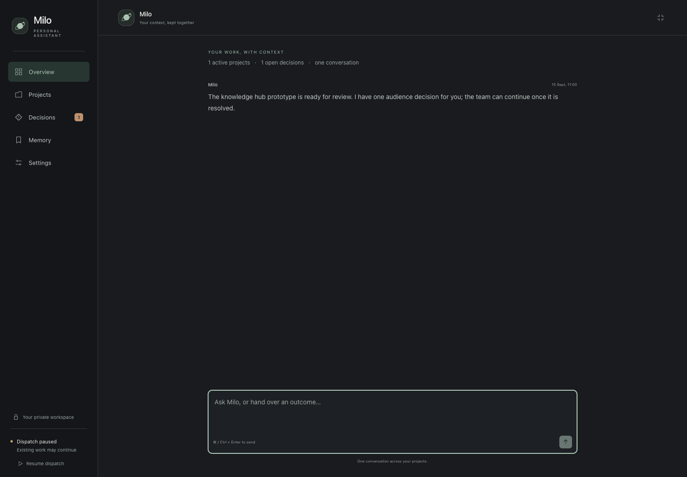
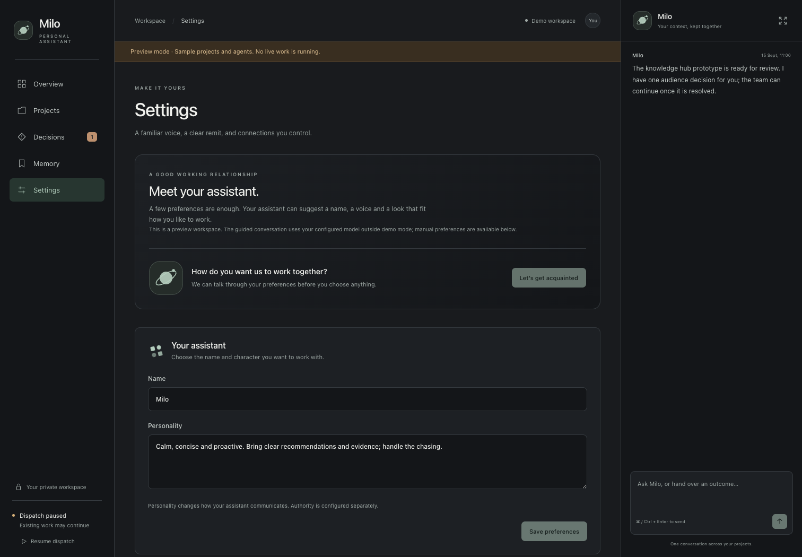

# Workspace identity and CLI connections — 2026-09-15

As of this implementation; nothing external versioned beyond the installed CLI contracts checked during development.

The owner renamed the checkout to `agent-assistant`. The command and GitHub repository already used that name. The persistence namespace was changed to the owner's requested `agent-assistant.paulie.app`; the display name remained independent. Existing config/state pairs were retained in their old namespace, while ambiguous mixed namespaces required explicit paths. No automatic file move or credential migration was introduced.

## Connections belonged to their CLIs

The assistant's connection settings selected existing named accounts from `lin`, `agent-slack`, `agent-notion`, and `agent-fathom`. The daemon stored only connection labels, tools, and allowed profiles. It did not duplicate their login or secret management. Each model query specified the connection and profile explicitly. Fixed read operations and argument arrays prevented a query from becoming arbitrary shell execution or selecting an unapproved account.

Slack bot messaging remained separate. Socket Mode supplied inbound owner messages and replies; the owner's `agent-slack` account supplied richer querying. The legacy direct Linear adapter remained compatible with explicit old configurations.

The installed Notion CLI lacked a per-command workspace selector. Its accounts could be discovered, but queries remained disabled rather than changing a process-global default or risking reads from the wrong workspace. Adding such a selector to that CLI was the remaining dependency for Notion queries.

## Identity was an interview and a preview

A separate setup conversation asked for useful preferences and used the PA model to recommend its name, practical working personality, theme, and avatar. Only the owner could apply a proposal, by its exact recommendation ID. These tools could not modify project authority or invoke other integrations. The interview was persisted privately so it could survive a restart.

Avatar generation meant a vector symbol drawn from model-selected validated shapes and colors. Model-supplied markup was never rendered. This supplied a functional avatar without adding an image-provider credential or claiming to support image-model illustration.

## Theme options

| Theme | Character |
| --- | --- |
| Graphite + sage | Neutral charcoal surfaces, warm readable text, restrained green accents; selected default. |
| Ink + soft blue | Cooler and more technical, with quiet blue accents. |
| Charcoal + warm amber | Warmer contrast and amber accents, without making every surface look like a warning. |

The dashboard remained dark-first. Chat could expand into the primary horizontal workspace. Waiting indicators animated without pretending to expose token-by-token model progress; reduced-motion preferences suppressed the movement.

## Models and instruction isolation

The PA retained `codex / gpt-6-astra / high`. The built-in downstream worker default changed to `codex / gpt-5.6-terra / high`. Saved profiles were preserved, and external manager brokers remained responsible for their own model selection. Opus was a possible future choice; no unsupported Claude driver was implied by listing it as an alternative.

The dedicated `CODEX_HOME` was an instruction-isolation measure. The installed Codex still loaded global AGENTS files despite project-instruction disabling. The adapter rejected such homes before inference. A persistent dedicated home allowed login refresh and could use the owner's existing account; it did not require a second subscription. Credentials were neither copied from nor removed from the user's normal home. CLI connections continued to use their own normal XDG/credential stores, independently of the model's Codex home.

Reference checked: [OpenAI's global instruction loading order](https://learn.chatgpt.com/docs/agent-configuration/agents-md).

## Rendered workspace

Captured from the isolated fictional demo during verification:

